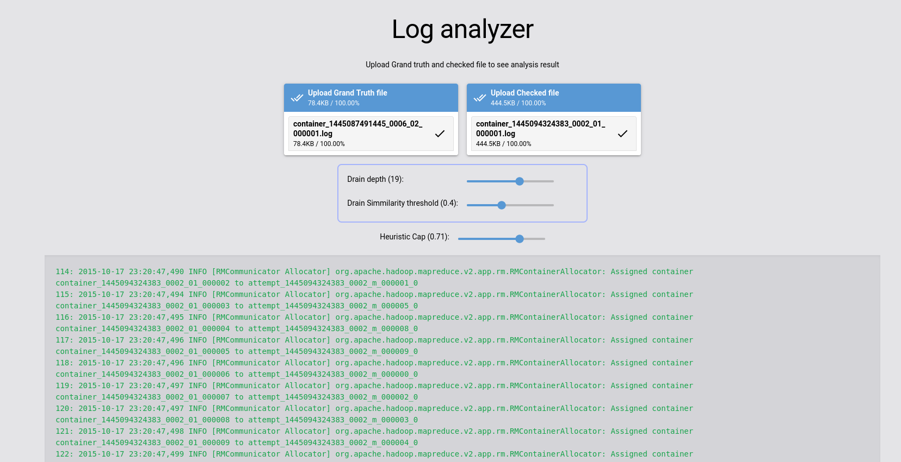

# Log analyzer

This is a repo for our reasearch project 5@KAMS.



## Local installation

This project is using `poetry` build system.
You need to install poetry first on your system.
To do that, please see installation guide: https://python-poetry.org/docs/

```shell
poetry install
bash start.sh dev  # For development server
bash start.sh prod # For production server
```

## Running tests

This project uses `pytest` for testing.
To run full test suite, run:

```shell
poetry run python test.py
```
